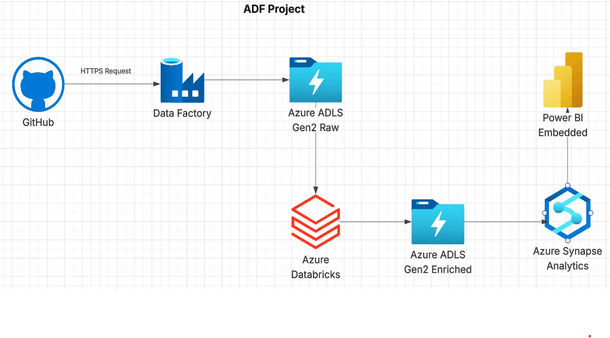

# End-to-End Azure Data Engineering Pipeline

## Project Overview

This project demonstrates an end-to-end data engineering pipeline built using Microsoft Azure services. The pipeline ingests raw data from GitHub, stores it in Azure Data Lake Storage Gen2, processes and transforms the data using Azure Databricks and PySpark, and makes the refined data available for analytics through Azure Synapse Analytics and Power BI.

## Architecture

**GitHub → Azure Data Factory → ADLS Gen2 → Azure Databricks/PySpark → ADLS Gen2 → Azure Synapse Analytics → Power BI**

## Technologies Used

* Azure Data Factory (ADF)
* Azure Data Lake Storage Gen2 (ADLS Gen2)
* Azure Databricks
* Apache Spark / PySpark
* Azure Synapse Analytics
* Power BI
* GitHub

## Pipeline Flow

1. **Data Ingestion**

   * Azure Data Factory was used to retrieve source data from GitHub using HTTPS.
   * The raw data was stored in Azure Data Lake Storage Gen2.

2. **Data Processing & Transformation**

   * Azure Databricks was used for data processing.
   * PySpark was used to clean, transform, and enrich the raw dataset.
   * The processed data was stored back in ADLS Gen2.

3. **Data Analytics**

   * Azure Synapse Analytics was used to query and analyze the processed data.
   * The refined dataset was made available for analytical use.

4. **Data Visualization**

   * Power BI was connected to the analytical layer to create visualizations and dashboards.

## Key Learning Outcomes

* Designed an end-to-end Azure data engineering workflow.
* Practiced data ingestion using Azure Data Factory.
* Worked with Azure Data Lake Storage Gen2 for raw and processed data.
* Performed data transformation using Databricks and PySpark.
* Used Azure Synapse Analytics for analytical querying.
* Integrated the data platform with Power BI for visualization.
* Gained hands-on experience working with multiple Azure data engineering services.

## Project Screenshot

