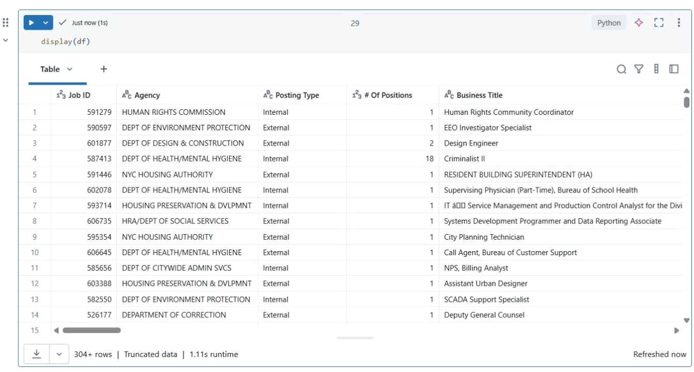
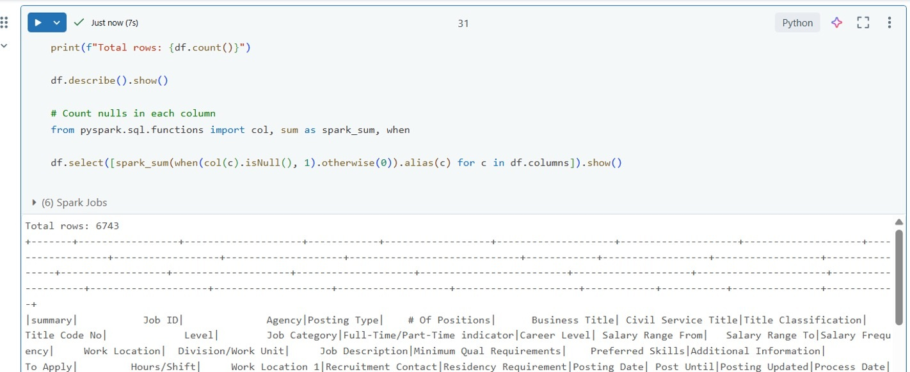
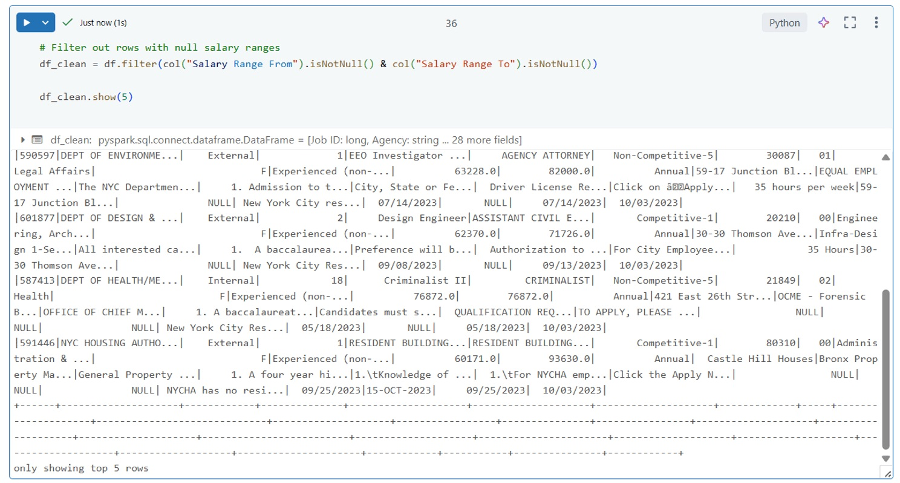
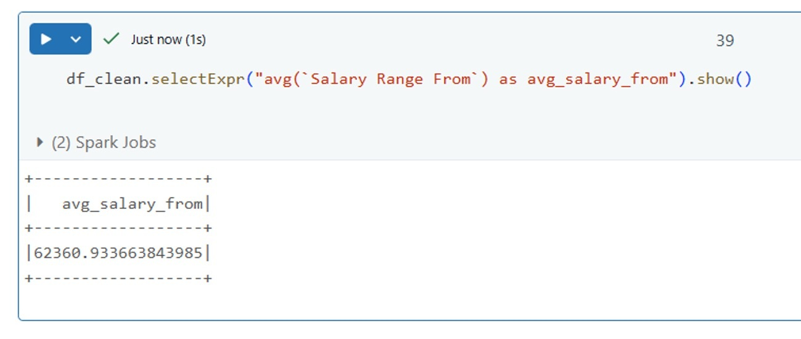

# Azure Databricks Transformation

Azure Databricks was used as the data transformation and processing layer in this project.

PySpark was used to perform data cleaning, transformation, and enrichment on the raw dataset before storing the processed data back in Azure Data Lake Storage Gen2.

## Transformation Process

* Read raw data from ADLS Gen2
* Performed data cleansing and transformations using PySpark
* Generated a refined dataset
* Stored the processed data back in ADLS Gen2

## Transformation Screenshots

### 1. Data Ingestion

### 2. Data Cleaning

### 3. Data Transformation

### 4. Final Output

