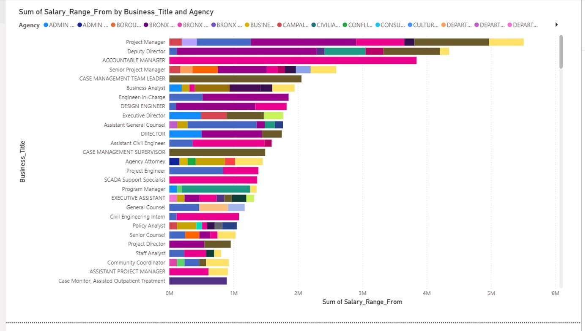
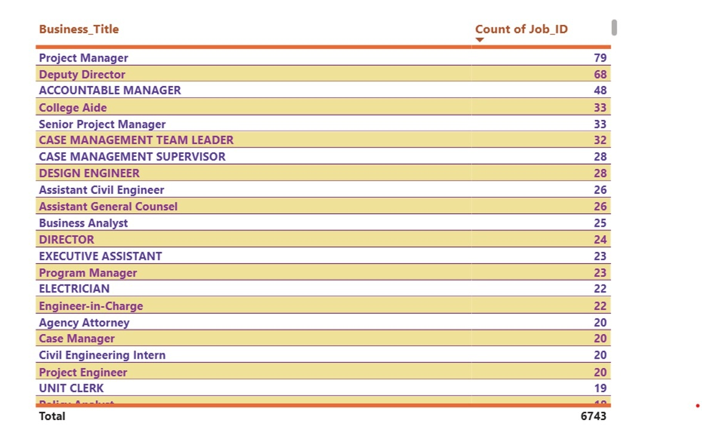
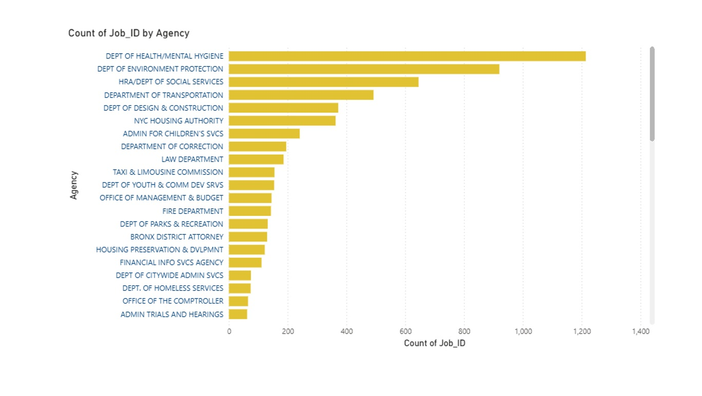

# Power BI Visualization

Power BI was used as the visualization layer of the Azure data engineering pipeline.

The processed data available through Azure Synapse Analytics was used to create visualizations and present analytical insights.

## Responsibilities

- Connected Power BI to the analytical data layer.
- Used the processed dataset for visualization.
- Created reports to present insights from the data.
- Enabled business users to interact with the analytical results.

## Power BI Screenshots

### Power BI Report

### Power BI Visualization

### Power BI Visualization

