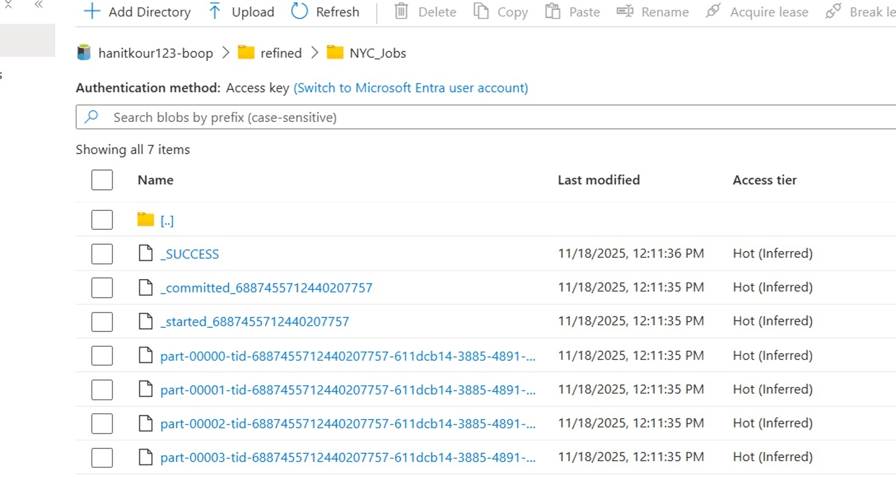

# Azure Synapse Analytics

Azure Synapse Analytics was used as the analytical layer of the project.

The transformed data generated through Azure Databricks was made available for analytical querying in Synapse Analytics.

## Responsibilities

- Created an external table to access the processed data.
- Used SQL queries to analyze the transformed dataset.
- Validated the processed data through analytical queries.
- Prepared the data for downstream visualization in Power BI.

## Data Flow

**ADLS Gen2 → Azure Synapse Analytics → Power BI**

## Synapse Screenshots

### Screenshot 1

### Screenshot 2

